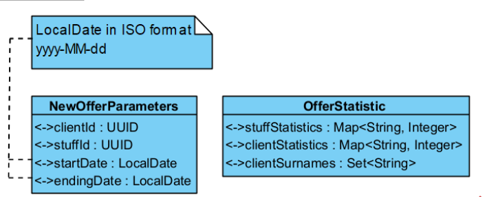

# serverOffice
Разработать REST сервис с использованием Spring Boot. Сервер работает на 8080 порту. Условия принятия практики - мобильное приложение понимает ответы от вашего сервера и выводит данные на экран.
 

Расширить возможности сервиса лизинговой компании:
-	Вести статистику:
1.	Сколько договоров оформил каждый сотрудник. Для хранения использовать Map.
2.	Сколько договоров заключено с клиентами. Для хранения использовать Map.
3.	Фамилий клиентов. Для хранения использовать Set.
Статистика должна обновляться с каждым новым договором.
 

 
